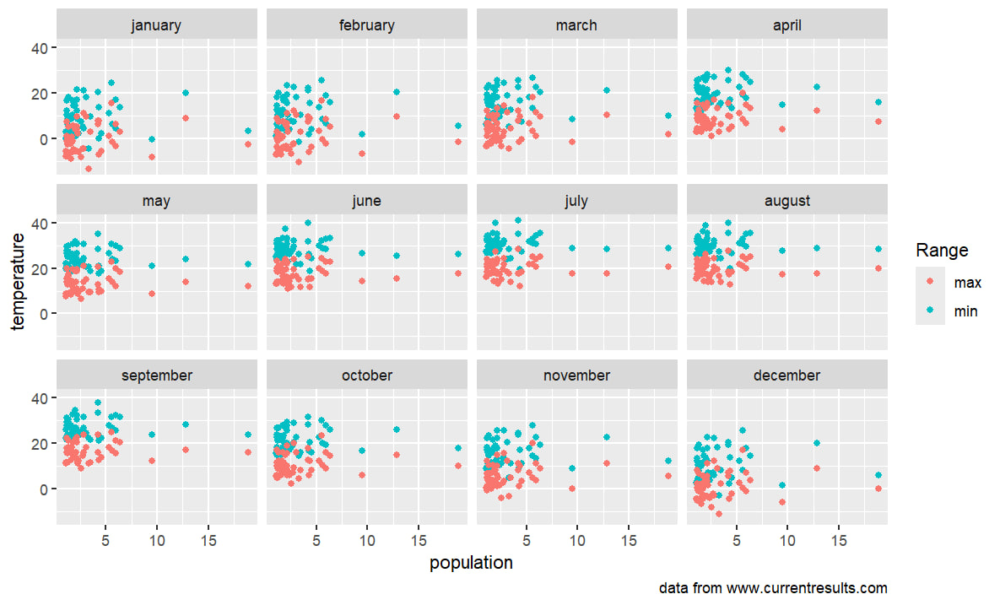
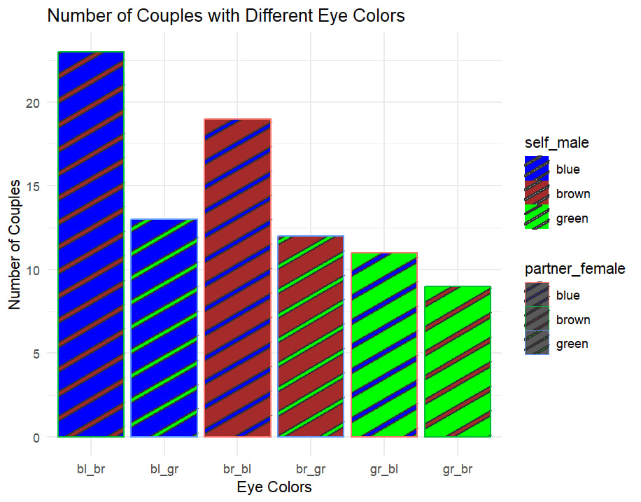

# Assignment 2

## Ex.1 

#### Importing packages and reading the file
```
library(tidyverse)
library(stringr)

dictionary <- read_tsv('https://raw.githubusercontent.com/agricolamz/DS_for_DH/master/data/freq_dict_2011.csv')
```
#### Switching to lowercase
```
dictionary[] <- lapply(dictionary, function(x) {
  if (is.character(x)) {
    tolower(x)
  } else {
    x
  }
})
```
#### I'm creating a list of all lemmas in the dictionary. I'm also manually creating a list of all the cyrillic characters I'm going to count.
```
lemmas <- as.character(dictionary$lemma)

characters <- c('а', 'б', 'в', 'г', 'д', 'е', 'ж', 'з', 'и', 'й', 'к', 'л', 'м', 'н', 'о', 'п', 'р', 'с', 'т', 'у', 'ф', 'х', 'ц', 'ч', 'ш', 'щ', 'ъ', 'ы', 'ь', 'э', 'ю', 'я')
```
#### Here I'm counting the frequency of each sumbol in the lemmas.
```
frequency <- sapply(characters, function(char) {
  sum(sapply(lemmas, function(lemma) str_count(lemma, fixed(char))))
})

fr <- data.frame(character = characters, frequency = frequency)
```
#### Finally, the plot
```
fr %>%
  ggplot(aes(reorder(character, frequency), frequency))+
  geom_col(show.legend = FALSE)+
  coord_flip()+
  labs(x = NULL, y= NULL, caption = "данные из [Ляшевская, Шаров 2011]")+
  theme_bw()
```


## Ex. 2
#### Importing packages and reading the file
```
library(tidyverse)

data <- read_csv("https://raw.githubusercontent.com/agricolamz/DS_for_DH/master/data/us_city_average_temperature.csv")
```
#### A function to convert Fahrenheit to Celsius
```
convert_to_celsius <- function(temp) {
  (temp - 32) * 5/9
}
```

#### Manually gather min and max temperatures into a long format
```
months <- c("january", "february", "march", "april", "may", "june",
            "july", "august", "september", "october", "november", "december")
```

#### Create an empty data frame
data_long <- data.frame()

#### Appending min temperatures
```
for (month in months) {
  data_long <- rbind(data_long, data.frame(
    month = month,
    range = "min",
    temperature = convert_to_celsius(data[[paste0("min_", month)]]),
    population = data$population_2010
  ))
```
  
  #### Appending max temperatures
  ```
  data_long <- rbind(data_long, data.frame(
    month = month,
    range = "max",
    temperature = convert_to_celsius(data[[paste0("max_", month)]]),
    population = data$population_2010
  ))
}
```

#### Converting month to a factor to control order in the plot
```
data_long$month <- factor(data_long$month, levels = months)
```

#### Creating the plot
```
ggplot(data_long, aes(x = population / 1e6, y = temperature, color = range)) +
  geom_point() +
  facet_wrap(~ month, ncol = 4) +
  labs(
    x = "population",
    y = "temperature",
    color = "Range",
    caption = "data from www.currentresults.com"
  )
```


## Ex. 3
#### Importing packages and reading the file
```
library(dplyr)
library(ggpattern)

eyes <- read.csv('https://raw.githubusercontent.com/Whereamiactually/R/main/Couple%20Eye%20Colors.csv')
```
#### I'm removing all the pairs with the same eye colour
```
eyes <- eyes %>%
  filter(self_male != partner_female)
```
#### Adding a column with the joined colours
```
sub <- function(a)
  a = str_sub(a, 1, 2)

eyes <- eyes %>%
  mutate(couple = paste(sub(self_male), sub(partner_female), sep = "_"))
```
#### Countimg the values
```
count_eyes <- eyes %>%
  group_by(couple, self_male, partner_female) %>%
  summarize(count = n(), .groups = 'drop')
```
#### The plot
```
count_eyes %>%
  ggplot(aes(x = couple, y = count, fill = self_male, colour = partner_female)) +
  geom_col_pattern(aes(pattern_fill = partner_female), 
                   position = "stack", 
                   pattern = "stripe", 
  ) +
  theme_minimal() +
  scale_fill_manual(values = c("brown" = "brown", 
                               "blue" = "blue", 
                               "green" = "green" ))+
  scale_pattern_fill_manual(values = c("brown" = "brown", 
                                       "blue" = "blue", 
                                       "green" = "green" ))+
  labs(title = "Number of Couples with Different Eye Colors",
       x = "Eye Colors",
       y = "Number of Couples")
```


