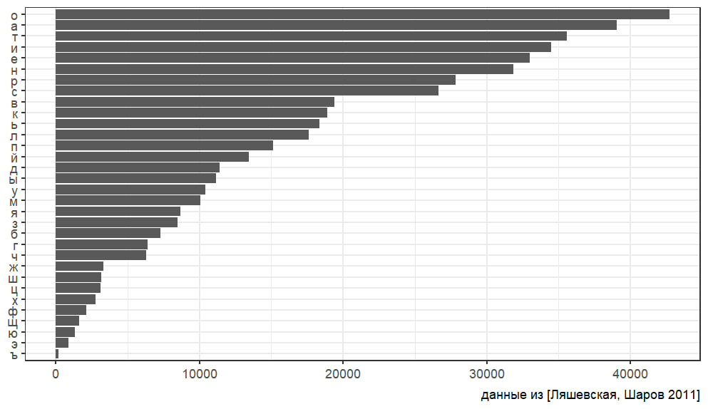

# Assignment 2

## Ex.1 

#### Importing packages and reading the file
```
library(tidyverse)
library(stringr)

dictionary <- read_tsv('https://raw.githubusercontent.com/agricolamz/DS_for_DH/master/data/freq_dict_2011.csv')
```
#### Switching to lowercase
```
dictionary[] <- lapply(dictionary, function(x) {
  if (is.character(x)) {
    tolower(x)
  } else {
    x
  }
})
```
#### I'm creating a list of all lemmas in the dictionary. I'm also manually creating a list of all the cyrillic characters I'm going to count.
```
lemmas <- as.character(dictionary$lemma)

characters <- c('а', 'б', 'в', 'г', 'д', 'е', 'ж', 'з', 'и', 'й', 'к', 'л', 'м', 'н', 'о', 'п', 'р', 'с', 'т', 'у', 'ф', 'х', 'ц', 'ч', 'ш', 'щ', 'ъ', 'ы', 'ь', 'э', 'ю', 'я')
```
#### Here I'm counting the frequency of each sumbol in the lemmas.
```
frequency <- sapply(characters, function(char) {
  sum(sapply(lemmas, function(lemma) str_count(lemma, fixed(char))))
})

fr <- data.frame(character = characters, frequency = frequency)
```
#### Finally, the plot
```
fr %>%
  ggplot(aes(reorder(character, frequency), frequency))+
  geom_col(show.legend = FALSE)+
  coord_flip()+
  labs(x = NULL, y= NULL, caption = "данные из [Ляшевская, Шаров 2011]")+
  theme_bw()
```



